<div align="center">

<!-- ========================================== -->
<!-- 01 · HEADER HERO (PROBLEM → SYSTEM → BUILD → SHIP) -->
<!-- ========================================== -->


<br><br>

<!-- ========================================== -->
<!-- 02 · TERMINAL WORKSTATION (ASCII PORTRAIT + INFO CARD) -->
<!-- ========================================== -->

<p align="center">
  <code>vigneshwar@thedot:~$ ./workstation.sh --dual-pane</code>
</p>

<table>
  <tr>
    <td width="50%" valign="top" align="center">
      
    </td>
    <td width="50%" valign="top" align="center">
      
    </td>
  </tr>
</table>

<br><br>

<!-- ========================================== -->
<!-- 03 · ANIMATED CONTRIBUTION HEATMAP -->
<!-- ========================================== -->

<p align="center">
  <code>vigneshwar@thedot:~$ git log --all --graph --since="1 year"</code>
</p>



<br><br>

</div>

---

### What I Build

```
01 / INTELLIGENT SYSTEMS
     Automation, applied AI workflows and connected operational software.

02 / PRODUCT ENGINEERING
     Turning business problems and ideas into robust, production-ready software.

03 / INTERACTION ENGINEERING
     Interfaces and digital experiences where engineering rigour meets intuitive craft.

04 / DIGITAL TRANSFORMATION
     Modernizing legacy workflows, tools and customer operations into unified systems.
```

---

### Connect & Collaborations

<div align="left">

- **Company:** [The Dot](https://www.thedotco.in/) — *Digital Transformation & Product Engineering Studio*
- **LinkedIn:** [vigneshwar-ramadoss](https://www.linkedin.com/in/vigneshwar-ramadoss-2b39b3267/)
- **Email:** [YOUR_EMAIL](mailto:YOUR_EMAIL) <!-- Replace with your email address -->
- **Portfolio:** [YOUR_PORTFOLIO_URL](https://YOUR_PORTFOLIO_URL) <!-- Replace with your portfolio URL -->
- **X / Twitter:** [@YOUR_X_HANDLE](https://x.com/YOUR_X_HANDLE) <!-- Replace with your X handle -->

</div>
